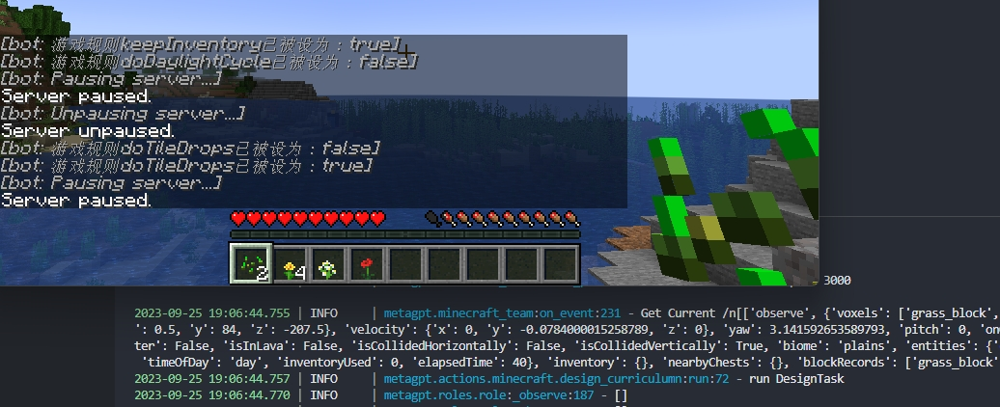
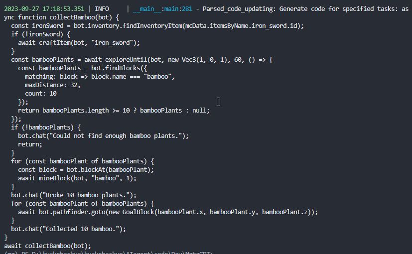

## MG-MC记录文档

### 0926： 环境信息获取和更新 on_event()实际内容

1.Nodejs + Mineflayer配置

  A.自行安装[Node.js (nodejs.org)](https://nodejs.org/en)

  B.clone完之后，必须重新继续Mineflayer配置

  ```bash
  cd metagpt/mineflayer_env/mineflayer
  npm install -g npx
  npm install
  cd mineflayer-collectblock
  npm install
  npx tsc
  cd ..
  npm install
  ```

2.在mg环境上额外执行

```python
pip install -r mc_requirement.txt
```

3.配置完游戏后，在 minecraft_run.py 下修改

```python
    mc_player.set_port(2465) # Modify this to your LAN port
```

*注意世界游戏模式为生存，这样人物才会有血量，饥饿和库存概念；*

python minecraft_run.py




### 0927：Action_developer 更新

对应需实现 GenerateActionCode ，完成对应的和 GameEnvironment 的交
互和 Environment 的信息传递

测试结果  




### 0930：Curriculum agent 更新

对应需实现 DesignTask和DesignCurriculum，以及与Environment 的信息传递。


**BUG FIX(0930)：**

A.在前面的提交中，由于ignore了mineflayer下的lib，会造成如下报错

```bash
metagpt.minecraft_team:on_event:143 - Failed to retrieve Minecraft events: HTTPConnectionPool(host='127.0.0.1', port=3000): Max retries exceeded with url: /start (Caused by NewConnectionError('<urllib3.connection.HTTPConnection object at 0x7fa7a0556130>: Failed to establish a new connection: [Errno 111] Connection refused'))
```

解决方法：

1. 若本地已克隆项目不好更改可尝试：删除 metagpt/mineflayer_env/mineflayer + 重新copy voyager/env/mineflayer到目录下 + （npm install...0926.B命令）
2. 重新拉取最新提交+重新配置

### 第一人称视角

目前使用3007端口，可自行修改，代码运行以后，在浏览器输入127.0.0.1:3007访问