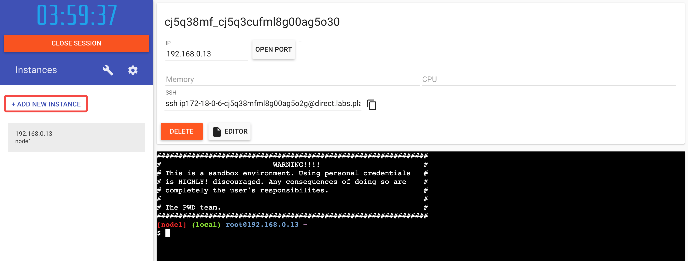
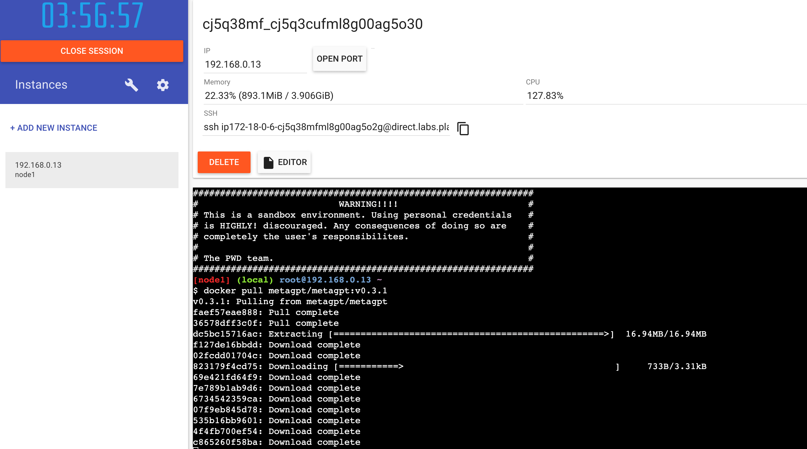
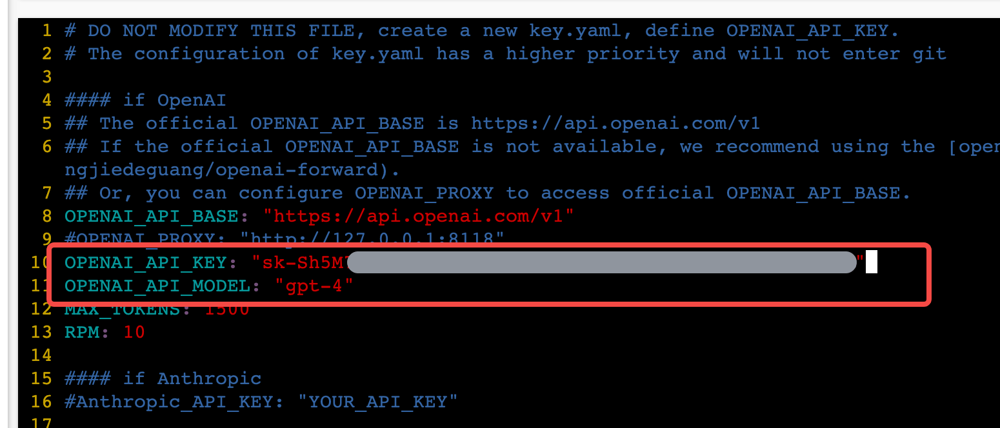
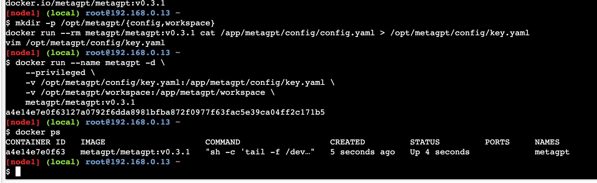
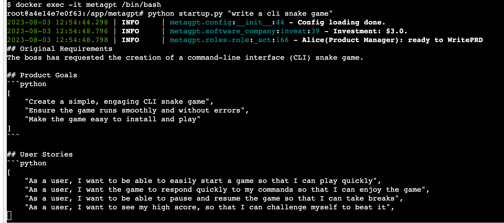
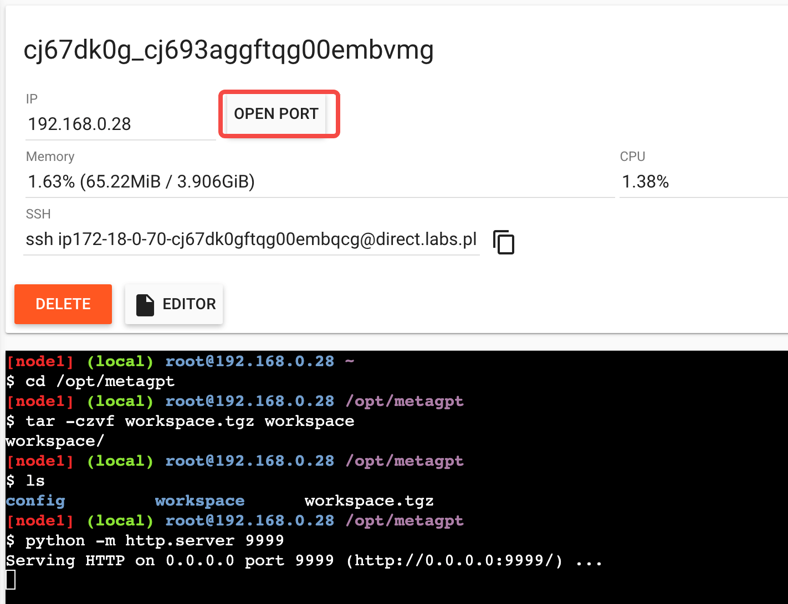
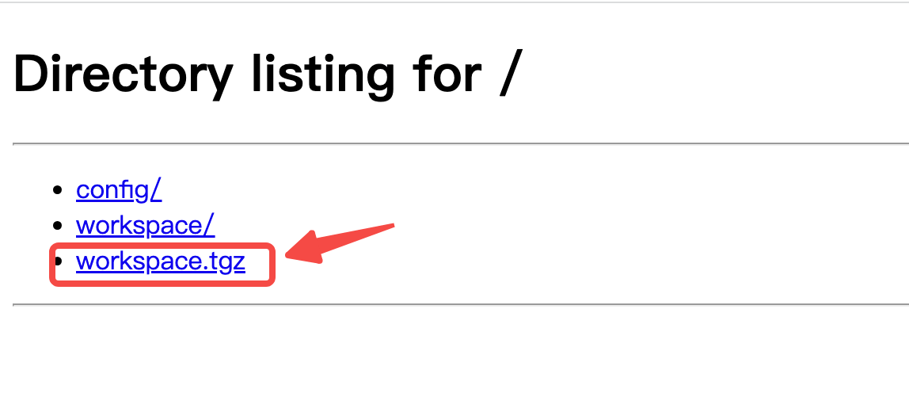

# MetaGPT快速体验
## 前言
很多同学想要体验MetaGPT的同学，都卡在了第一步：安装配置基础环境。  
本文的目标就是为了弱化环境限制，让大家快速体验到MetaGPT的魅力。在不依赖任何本地环境的基础上（只要你有一个浏览器），让MetaGPT开始工作，整个操作大概需要5到10分钟。

## Step 1：准备云端环境
不依赖本地环境，那么我们需要一个云端环境。这里我们选择使用[Docker Playground](https://labs.play-with-docker.com/)，因为这个环境具备Docker，同时可以访问 `https://api.openai.com/v1`，关键还免费。

具体操作：

1. 访问[Docker Playground](https://labs.play-with-docker.com/)，使用docker hub账号登录。没有账号的话先注册一个，也是免费的。


注意：因为资源有限，所以有时候可能登录失败，报错：We are really sorry but we are out of capacity and cannot create your session at the moment. Please try again later.

如果出现上面的提示，可以等待一会儿后再次登录，也可以改用[Kubernetes Playground](https://labs.play-with-k8s.com/)。当然，如果你有更合适的云端环境，也是可以的。

2. 登录到Docker Playground后，点击 `ADD NEW INSTANCE`，启动一个虚拟机。



## Step 2：准备MetaGPT配置
参考文档 [MetaGPT README](https://github.com/geekan/MetaGPT/blob/main/README.md) 的 Installation by Docker 部分，执行操作：

1. 下载镜像
```bash
docker pull metagpt/metagpt:v0.3.1
```


2. 准备挂载目录和配置文件
```bash
mkdir -p /opt/metagpt/{config,workspace}
docker run --rm metagpt/metagpt:v0.3.1 cat /app/metagpt/config/config.yaml > /opt/metagpt/config/key.yaml
vim /opt/metagpt/config/key.yaml # Change the config
```



编辑 key.yaml 时，如果使用的是OPENAI的API，那么只需要修改 `OPENAI_API_MODEL` 和 `OPENAI_API_KEY`，这两个值需要对应，`gpt-4`要对应 gpt-4 的KEY，`gpt-3.5-turbo`要对应 gpt-3.5 的KEY。

## Step 3：让MetaGPT工作
1. 运行一个MetaGPT容器
```bash
docker run --name metagpt -d \
    --privileged \
    -v /opt/metagpt/config/key.yaml:/app/metagpt/config/key.yaml \
    -v /opt/metagpt/workspace:/app/metagpt/workspace \
    metagpt/metagpt:v0.3.1
```


2. 进入容器内部执行命令
```bash
docker exec -it metagpt /bin/bash
$ python startup.py "write a cli snake game"
```



容器内生成的文件会存放在目录 `/app/metagpt/workspace` ，对应宿主机目录 `/opt/metagpt/workspace` 。

## Step 4：下载项目
1. 打包workspace
```bash
# 宿主机中执行
cd /opt/metagpt
tar -czvf workspace.tgz workspace
```

2. 启动web服务以便下载项目
```bash
python -m http.server 9999
```

3. Docker Playground开放端口
点击页面上的 `OPEN PORT`，输入 `9999`，点击确定，即可打开Web页面。



4. 下载项目
在Web页面上，点击 `workspace.tgz` ，即可下载MetaGTP生成的项目。
