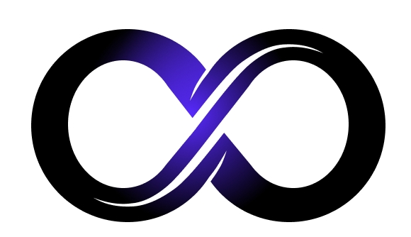

# MetaGPT: 多智能体框架

<p align="center">
<a href=""></a>
</p>

<p align="center">
<b>使 GPTs 组成软件公司，协作处理更复杂的任务</b>
</p>

<p align="center">
<a href="docs/README_CN.md"></a>
<a href="README.md"></a>
<a href="docs/README_JA.md"></a>
<a href="https://discord.gg/wCp6Q3fsAk"></a>
<a href="https://opensource.org/licenses/MIT"></a>
<a href="docs/ROADMAP.md"></a>
<a href="https://twitter.com/DeepWisdom2019"></a>
</p>

<p align="center">
   <a href="https://airtable.com/appInfdG0eJ9J4NNL/shrEd9DrwVE3jX6oz"></a>
   <a href="https://vscode.dev/redirect?url=vscode://ms-vscode-remote.remote-containers/cloneInVolume?url=https://github.com/geekan/MetaGPT"></a>
   <a href="https://codespaces.new/geekan/MetaGPT"></a>
   <a href="https://huggingface.co/spaces/deepwisdom/MetaGPT" target="_blank"></a>
</p>

1. MetaGPT输入**一句话的老板需求**，输出**用户故事 / 竞品分析 / 需求 / 数据结构 / APIs / 文件等**
2. MetaGPT内部包括**产品经理 / 架构师 / 项目经理 / 工程师**，它提供了一个**软件公司**的全过程与精心调配的SOP
   1. `Code = SOP(Team)` 是核心哲学。我们将SOP具象化，并且用于LLM构成的团队


<p align="center">软件公司多角色示意图（正在逐步实现）</p>

## MetaGPT 的能力

https://github.com/geekan/MetaGPT/assets/34952977/34345016-5d13-489d-b9f9-b82ace413419


## 示例（均由 GPT-4 生成）

例如，键入`python startup.py "写个类似今日头条的推荐系统"`并回车，你会获得一系列输出，其一是数据结构与API设计


这需要大约**0.2美元**（GPT-4 API的费用）来生成一个带有分析和设计的示例，大约2.0美元用于一个完整的项目

## 安装

### 传统安装

```bash
# 第 1 步：确保您的系统上安装了 NPM。并使用npm安装mermaid-js
npm --version
sudo npm install -g @mermaid-js/mermaid-cli

# 第 2 步：确保您的系统上安装了 Python 3.9+。您可以使用以下命令进行检查：
python --version

# 第 3 步：克隆仓库到您的本地机器，并进行安装。
git clone https://github.com/geekan/metagpt
cd metagpt
pip install -e.
```

**注意：**

- 如果已经安装了Chrome、Chromium或MS Edge，可以通过将环境变量`PUPPETEER_SKIP_CHROMIUM_DOWNLOAD`设置为`true`来跳过下载Chromium。

- 一些人在全局安装此工具时遇到问题。在本地安装是替代解决方案，

    ```bash
    npm install @mermaid-js/mermaid-cli
    ```

- 不要忘记在config.yml中为mmdc配置配置，

    ```yml
    PUPPETEER_CONFIG: "./config/puppeteer-config.json"
    MMDC: "./node_modules/.bin/mmdc"
    ```

- 如果`pip install -e.`失败并显示错误`[Errno 13] Permission denied: '/usr/local/lib/python3.11/dist-packages/test-easy-install-13129.write-test'`，请尝试使用`pip install -e. --user`运行。

### Docker安装

```bash
# 步骤1: 下载metagpt官方镜像并准备好config.yaml
docker pull metagpt/metagpt:v0.3
mkdir -p /opt/metagpt/{config,workspace}
docker run --rm metagpt/metagpt:v0.3 cat /app/metagpt/config/config.yaml > /opt/metagpt/config/config.yaml
vim /opt/metagpt/config/config.yaml # 修改config

# 步骤2: 使用容器运行metagpt演示
docker run --rm \
    --privileged \
    -v /opt/metagpt/config:/app/metagpt/config \
    -v /opt/metagpt/workspace:/app/metagpt/workspace \
    metagpt/metagpt:v0.3 \
    python startup.py "Write a cli snake game"

# 您也可以启动一个容器并在其中执行命令
docker run --name metagpt -d \
    --privileged \
    -v /opt/metagpt/config:/app/metagpt/config \
    -v /opt/metagpt/workspace:/app/metagpt/workspace \
    metagpt/metagpt:v0.3

docker exec -it metagpt /bin/bash
$ python startup.py "Write a cli snake game"
```

`docker run ...`做了以下事情:

- 以特权模式运行，有权限运行浏览器
- 将主机目录 `/opt/metagpt/config` 映射到容器目录`/app/metagpt/config`
- 将主机目录 `/opt/metagpt/workspace` 映射到容器目录 `/app/metagpt/workspace`
- 执行演示命令 `python startup.py "Write a cli snake game"`

### 自己构建镜像

```bash
# 您也可以自己构建metagpt镜像
git clone https://github.com/geekan/MetaGPT.git
cd MetaGPT && docker build -t metagpt:v0.3 .
```

## 配置

- 在 `config/key.yaml / config/config.yaml / env` 中配置您的 `OPENAI_API_KEY`
- 优先级顺序：`config/key.yaml > config/config.yaml > env`

```bash
# 复制配置文件并进行必要的修改
cp config/config.yaml config/key.yaml
```

| 变量名                              | config/key.yaml                           | env                                             |
| ----------------------------------- | ----------------------------------------- | ----------------------------------------------- |
| OPENAI_API_KEY # 用您自己的密钥替换 | OPENAI_API_KEY: "sk-..."                  | export OPENAI_API_KEY="sk-..."                  |
| OPENAI_API_BASE # 可选              | OPENAI_API_BASE: "https://<YOUR_SITE>/v1" | export OPENAI_API_BASE="https://<YOUR_SITE>/v1" |

## 示例：启动一个创业公司

```shell
python startup.py "写一个命令行贪吃蛇"
# 开启code review模式会花费更多的金钱, 但是会提升代码质量和成功率
python startup.py "写一个命令行贪吃蛇" --code_review True
```

运行脚本后，您可以在 `workspace/` 目录中找到您的新项目。
### 平台或工具的倾向性
可以在阐述需求时说明想要使用的平台或工具。
例如：
```shell
python startup.py "写一个基于pygame的命令行贪吃蛇"
```

### 使用

```
名称
    startup.py - 我们是一家AI软件创业公司。通过投资我们，您将赋能一个充满无限可能的未来。

概要
    startup.py IDEA <flags>

描述
    我们是一家AI软件创业公司。通过投资我们，您将赋能一个充满无限可能的未来。

位置参数
    IDEA
        类型: str
        您的创新想法，例如"写一个命令行贪吃蛇。"

标志
    --investment=INVESTMENT
        类型: float
        默认值: 3.0
        作为投资者，您有机会向这家AI公司投入一定的美元金额。
    --n_round=N_ROUND
        类型: int
        默认值: 5

备注
    您也可以用`标志`的语法，来处理`位置参数`
```

### 代码实现

```python
from metagpt.software_company import SoftwareCompany
from metagpt.roles import ProjectManager, ProductManager, Architect, Engineer

async def startup(idea: str, investment: float = 3.0, n_round: int = 5):
    """运行一个创业公司。做一个老板"""
    company = SoftwareCompany()
    company.hire([ProductManager(), Architect(), ProjectManager(), Engineer()])
    company.invest(investment)
    company.start_project(idea)
    await company.run(n_round=n_round)
```

你可以查看`examples`，其中有单角色（带知识库）的使用例子与仅LLM的使用例子。

## 快速体验
对一些用户来说，安装配置本地环境是有困难的，下面这些教程能够让你快速体验到MetaGPT的魅力。  

- [MetaGPT快速体验](https://deepwisdom.feishu.cn/wiki/Q8ycw6J9tiNXdHk66MRcIN8Pnlg)

可直接在Huggingface Space体验

- https://huggingface.co/spaces/deepwisdom/MetaGPT

## 联系信息

如果您对这个项目有任何问题或反馈，欢迎联系我们。我们非常欢迎您的建议！

- **邮箱：** alexanderwu@fuzhi.ai
- **GitHub 问题：** 对于更技术性的问题，您也可以在我们的 [GitHub 仓库](https://github.com/geekan/metagpt/issues) 中创建一个新的问题。

我们会在2-3个工作日内回复所有问题。

## 演示

https://github.com/geekan/MetaGPT/assets/2707039/5e8c1062-8c35-440f-bb20-2b0320f8d27d

## 加入我们

📢 加入我们的Discord频道！
https://discord.gg/ZRHeExS6xv

期待在那里与您相见！🎉
