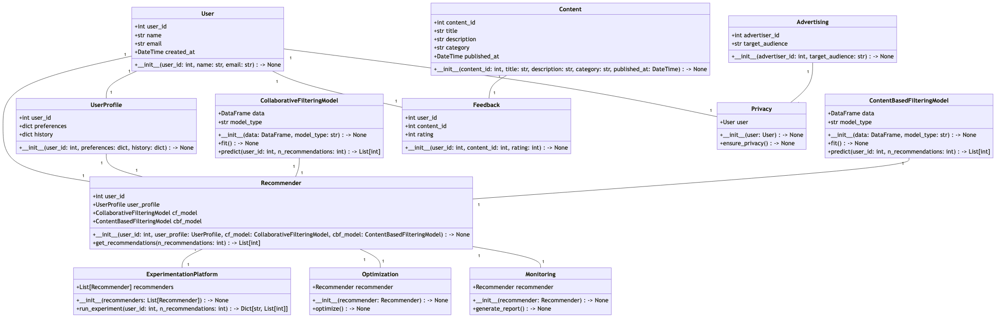

# MetaGPT: マルチエージェントフレームワーク

<p align="center">
<a href=""></a>
</p>

<p align="center">
<b>GPT にさまざまな役割を割り当てることで、複雑なタスクのための共同ソフトウェアエンティティを形成します。</b>
</p>

<p align="center">
<a href="docs/README_CN.md"></a>
<a href="README.md"></a>
<a href="docs/README_JA.md"></a>
<a href="https://discord.gg/wCp6Q3fsAk"></a>
<a href="https://opensource.org/licenses/MIT"></a>
<a href="docs/ROADMAP.md"></a>
<a href="https://twitter.com/MetaGPT_"></a>
</p>

<p align="center">
   <a href="https://vscode.dev/redirect?url=vscode://ms-vscode-remote.remote-containers/cloneInVolume?url=https://github.com/geekan/MetaGPT"></a>
   <a href="https://codespaces.new/geekan/MetaGPT"></a>
   <a href="https://huggingface.co/spaces/deepwisdom/MetaGPT" target="_blank"></a>
</p>

1. MetaGPT は、**1 行の要件** を入力とし、**ユーザーストーリー / 競合分析 / 要件 / データ構造 / API / 文書など** を出力します。
2. MetaGPT には、**プロダクト マネージャー、アーキテクト、プロジェクト マネージャー、エンジニア** が含まれています。MetaGPT は、**ソフトウェア会社のプロセス全体を、慎重に調整された SOP とともに提供します。**
   1. `Code = SOP(Team)` が基本理念です。私たちは SOP を具体化し、LLM で構成されるチームに適用します。


<p align="center">ソフトウェア会社のマルチロール図式（順次導入）</p>

## MetaGPT の能力


https://github.com/geekan/MetaGPT/assets/34952977/34345016-5d13-489d-b9f9-b82ace413419


## 例（GPT-4 で完全生成）

例えば、`python startup.py "Toutiao のような RecSys をデザインする"`と入力すると、多くの出力が得られます



解析と設計を含む 1 つの例を生成するのに約 **$0.2**（GPT-4 の API 使用料）、完全なプロジェクトでは約 **$2.0** かかります。


## インストール

### インストールビデオガイド

- [Matthew Berman: How To Install MetaGPT - Build A Startup With One Prompt!!](https://youtu.be/uT75J_KG_aY)

### 伝統的なインストール

```bash
# ステップ 1: Python 3.9+ がシステムにインストールされていることを確認してください。これを確認するには:
python --version

# ステップ 2: リポジトリをローカルマシンにクローンし、インストールする。
git clone https://github.com/geekan/MetaGPT.git
cd MetaGPT
pip install -e.

# ステップ 3: startup.py を実行する
# config.yaml を key.yaml にコピーし、独自の OPENAI_API_KEY を設定します
python3 startup.py "Write a cli snake game"

# ステップ 4 [オプション]: 実行中に PRD ファイルなどのアーティファクトを保存する場合は、ステップ 3 の前にこのステップを実行できます。デフォルトでは、フレームワークには互換性があり、この手順を実行しなくてもプロセス全体を完了できます。
# NPM がシステムにインストールされていることを確認してください。次に mermaid-js をインストールします。(お使いのコンピューターに npm がない場合は、Node.js 公式サイトで Node.js https://nodejs.org/ をインストールしてください。）
npm --version
sudo npm install -g @mermaid-js/mermaid-cli
```

**注:**

- すでに Chrome、Chromium、MS Edge がインストールされている場合は、環境変数 `PUPPETEER_SKIP_CHROMIUM_DOWNLOAD` を `true` に設定することで、
Chromium のダウンロードをスキップすることができます。

- このツールをグローバルにインストールする[問題を抱えている](https://github.com/mermaidjs/mermaid.cli/issues/15)人もいます。ローカルにインストールするのが代替の解決策です、

  ```bash
  npm install @mermaid-js/mermaid-cli
  ```

- config.yml に mmdc のコンフィグを記述するのを忘れないこと

  ```yml
  PUPPETEER_CONFIG: "./config/puppeteer-config.json"
  MMDC: "./node_modules/.bin/mmdc"
  ```

- もし `pip install -e.` がエラー `[Errno 13] Permission denied: '/usr/local/lib/python3.11/dist-packages/test-easy-install-13129.write-test'` で失敗したら、代わりに `pip install -e. --user` を実行してみてください

- Mermaid charts を SVG、PNG、PDF 形式に変換します。Node.js 版の Mermaid-CLI に加えて、Python 版の Playwright、pyppeteer、または mermaid.ink をこのタスクに使用できるようになりました。

  - Playwright
    - **Playwright のインストール**

    ```bash
    pip install playwright
    ```

    - **必要なブラウザのインストール**

    PDF変換をサポートするには、Chrominumをインストールしてください。

    ```bash
    playwright install --with-deps chromium
    ```

    - **modify `config.yaml`**

    config.yaml から MERMAID_ENGINE のコメントを外し、`playwright` に変更する

    ```yaml
    MERMAID_ENGINE: playwright
    ```

  - pyppeteer
    - **pyppeteer のインストール**

    ```bash
    pip install pyppeteer
    ```

    - **自分のブラウザを使用**

    pyppeteer を使えばインストールされているブラウザを使うことができます、以下の環境を設定してください

    ```bash
    export PUPPETEER_EXECUTABLE_PATH = /path/to/your/chromium or edge or chrome
    ```

    ブラウザのインストールにこのコマンドを使わないでください、これは古すぎます

    ```bash
    pyppeteer-install
    ```

    - **`config.yaml` を修正**

    config.yaml から MERMAID_ENGINE のコメントを外し、`pyppeteer` に変更する

    ```yaml
    MERMAID_ENGINE: pyppeteer
    ```

  - mermaid.ink
    - **`config.yaml` を修正**

    config.yaml から MERMAID_ENGINE のコメントを外し、`ink` に変更する

    ```yaml
    MERMAID_ENGINE: ink
    ```

    注: この方法は pdf エクスポートに対応していません。

### Docker によるインストール
> Windowsでは、"/opt/metagpt"をDockerが作成する権限を持つディレクトリに置き換える必要があります。例えば、"D:\Users\x\metagpt"などです。

```bash
# ステップ 1: metagpt 公式イメージをダウンロードし、config.yaml を準備する
docker pull metagpt/metagpt:latest
mkdir -p /opt/metagpt/{config,workspace}
docker run --rm metagpt/metagpt:latest cat /app/metagpt/config/config.yaml > /opt/metagpt/config/key.yaml
vim /opt/metagpt/config/key.yaml # 設定を変更する

# ステップ 2: コンテナで metagpt デモを実行する
docker run --rm \
    --privileged \
    -v /opt/metagpt/config/key.yaml:/app/metagpt/config/key.yaml \
    -v /opt/metagpt/workspace:/app/metagpt/workspace \
    metagpt/metagpt:latest \
    python startup.py "Write a cli snake game"

# コンテナを起動し、その中でコマンドを実行することもできます
docker run --name metagpt -d \
    --privileged \
    -v /opt/metagpt/config/key.yaml:/app/metagpt/config/key.yaml \
    -v /opt/metagpt/workspace:/app/metagpt/workspace \
    metagpt/metagpt:latest

docker exec -it metagpt /bin/bash
$ python startup.py "Write a cli snake game"
```

コマンド `docker run ...` は以下のことを行います:

- 特権モードで実行し、ブラウザの実行権限を得る
- ホスト設定ファイル `/opt/metagpt/config/key.yaml` をコンテナ `/app/metagpt/config/key.yaml` にマップします
- ホストディレクトリ `/opt/metagpt/workspace` をコンテナディレクトリ `/app/metagpt/workspace` にマップするs
- デモコマンド `python startup.py "Write a cli snake game"` を実行する

### 自分でイメージをビルドする

```bash
# また、自分で metagpt イメージを構築することもできます。
git clone https://github.com/geekan/MetaGPT.git
cd MetaGPT && docker build -t metagpt:custom .
```

## 設定

- `OPENAI_API_KEY` を `config/key.yaml / config/config.yaml / env` のいずれかで設定します。
- 優先順位は: `config/key.yaml > config/config.yaml > env` の順です。

```bash
# 設定ファイルをコピーし、必要な修正を加える。
cp config/config.yaml config/key.yaml
```

| 変数名                                  | config/key.yaml                           | env                                             |
| --------------------------------------- | ----------------------------------------- | ----------------------------------------------- |
| OPENAI_API_KEY # 自分のキーに置き換える | OPENAI_API_KEY: "sk-..."                  | export OPENAI_API_KEY="sk-..."                  |
| OPENAI_API_BASE # オプション            | OPENAI_API_BASE: "https://<YOUR_SITE>/v1" | export OPENAI_API_BASE="https://<YOUR_SITE>/v1" |

## チュートリアル: スタートアップの開始

```shell
# スクリプトの実行
python startup.py "Write a cli snake game"
# プロジェクトの実施にエンジニアを雇わないこと
python startup.py "Write a cli snake game" --implement False
# エンジニアを雇い、コードレビューを行う
python startup.py "Write a cli snake game" --code_review True
```

スクリプトを実行すると、`workspace/` ディレクトリに新しいプロジェクトが見つかります。

### プラットフォームまたはツールの設定

要件を述べるときに、どのプラットフォームまたはツールを使用するかを指定できます。

```shell
python startup.py "pygame をベースとした cli ヘビゲームを書く"
```

### 使用方法

```
会社名
    startup.py - 私たちは AI で構成されたソフトウェア・スタートアップです。私たちに投資することは、無限の可能性に満ちた未来に力を与えることです。

シノプシス
    startup.py IDEA <flags>

説明
    私たちは AI で構成されたソフトウェア・スタートアップです。私たちに投資することは、無限の可能性に満ちた未来に力を与えることです。

位置引数
    IDEA
        型: str
        あなたの革新的なアイデア、例えば"スネークゲームを作る。"など

フラグ
    --investment=INVESTMENT
        型: float
        デフォルト: 3.0
        投資家として、あなたはこの AI 企業に一定の金額を拠出する機会がある。
    --n_round=N_ROUND
        型: int
        デフォルト: 5

注意事項
    位置引数にフラグ構文を使うこともできます
```

### コードウォークスルー

```python
from metagpt.team import Team
from metagpt.roles import ProjectManager, ProductManager, Architect, Engineer

async def startup(idea: str, investment: float = 3.0, n_round: int = 5):
    """スタートアップを実行する。ボスになる。"""
    company = Team()
    company.hire([ProductManager(), Architect(), ProjectManager(), Engineer()])
    company.invest(investment)
    company.start_project(idea)
    await company.run(n_round=n_round)
```

`examples` でシングル・ロール（ナレッジ・ベース付き）と LLM のみの例を詳しく見ることができます。

## クイックスタート

ローカル環境のインストールや設定は、ユーザーによっては難しいものです。以下のチュートリアルで MetaGPT の魅力をすぐに体験できます。

- [MetaGPT クイックスタート](https://deepwisdom.feishu.cn/wiki/CyY9wdJc4iNqArku3Lncl4v8n2b)

Hugging Face Space で試す
- https://huggingface.co/spaces/deepwisdom/MetaGPT

## 引用

現時点では、[arXiv 論文](https://arxiv.org/abs/2308.00352)を引用してください:

```bibtex
@misc{hong2023metagpt,
      title={MetaGPT: Meta Programming for A Multi-Agent Collaborative Framework}, 
      author={Sirui Hong and Mingchen Zhuge and Jonathan Chen and Xiawu Zheng and Yuheng Cheng and Ceyao Zhang and Jinlin Wang and Zili Wang and Steven Ka Shing Yau and Zijuan Lin and Liyang Zhou and Chenyu Ran and Lingfeng Xiao and Chenglin Wu and Jürgen Schmidhuber},
      year={2023},
      eprint={2308.00352},
      archivePrefix={arXiv},
      primaryClass={cs.AI}
}
```

## お問い合わせ先

このプロジェクトに関するご質問やご意見がございましたら、お気軽にお問い合わせください。皆様のご意見をお待ちしております！

- **Email:** alexanderwu@fuzhi.ai
- **GitHub Issues:** 技術的なお問い合わせについては、[GitHub リポジトリ](https://github.com/geekan/metagpt/issues) に新しい issue を作成することもできます。

ご質問には 2-3 営業日以内に回答いたします。

## デモ

https://github.com/geekan/MetaGPT/assets/2707039/5e8c1062-8c35-440f-bb20-2b0320f8d27d

## 参加する

📢 Discord チャンネルに参加してください！
https://discord.gg/ZRHeExS6xv

お会いできることを楽しみにしています！ 🎉
