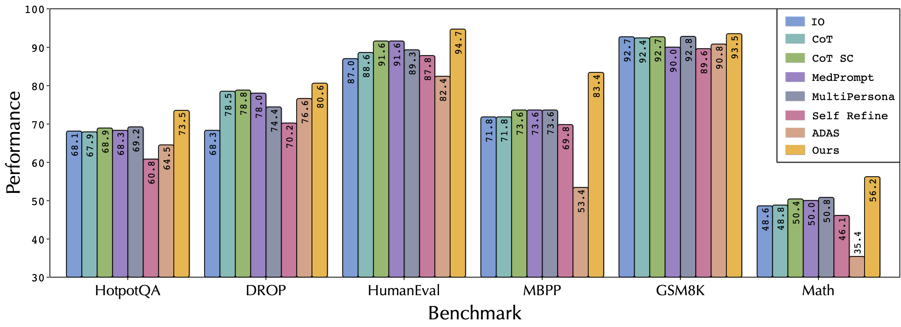
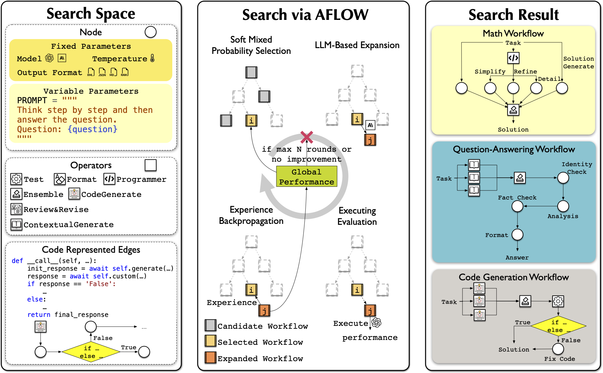
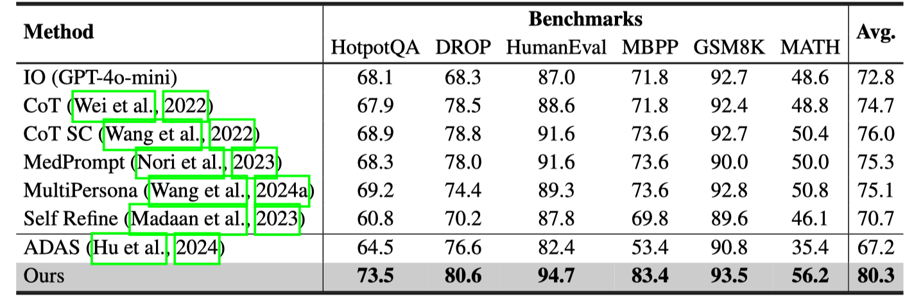

# AFlow: Automating Agentic Workflow Generation

AFlow is a framework for automatically generating and optimizing Agentic Workflows. It uses Monte Carlo tree search in a code-represented workflow space to find effective workflows, replacing manual development with machine effort. Our approach shows potential to outperform handcrafted workflows on various tasks. 

[Read our paper on arXiv](https://arxiv.org/abs/2410.10762)

<p align="center">
<a href="">1</sub>" width="80%"></a>
</p>

## Framework Components

- **Node**: Basic unit of LLM invocation. See `metagpt/actions/action_node.py` for a flexible interface to control LLM, temperature, format, and prompt.
- **Operator**: Predefined combinations of Nodes to enhance search efficiency. Encapsulates common operations like Generate, Format, Review, Revise, Ensemble, Test, and Programmer. See `metagpt/ext/aflow/operator.py` for details. You can customize your own Operator by referencing the implementations in this code.
- **Workflow**: A sequence of LLM-invoking nodes connected by edges. Can be represented as graphs, neural networks, or code to express various execution structures. See `metagpt/ext/aflow/workflow.py` for our implementation.
- **Optimizer**: Uses LLMs within a Monte Carlo Tree Search variant to explore and refine workflows. Iteratively selects, expands, evaluates, and updates workflows based on performance. See `metagpt/ext/aflow/scripts/optimizer.py` for details.
- **Evaluator**: Assesses workflow performance on given tasks. Provides feedback to guide the optimization process towards more effective workflows. See `metagpt/ext/aflow/scripts/evaluator.py` for details.

<p align="center">
<a href="">1</sub>" width="80%"></a>
</p>

## Datasets

### Experimental Datasets
We conducted experiments on six datasets (HumanEval, MBPP, GSM8K, MATH, HotpotQA, DROP) and provide their evaluation code. The data can be found in this [datasets](https://drive.google.com/uc?export=download&id=1DNoegtZiUhWtvkd2xoIuElmIi4ah7k8e) link, or you can download them using `metagpt/ext/aflow/data/download_data.py`

<p align="center">
<a href="">1</sub>" width="80%"></a>
</p>

### Custom Datasets
For custom tasks, you can reference the code in the `metagpt/ext/aflow/benchmark` folder. Inherit the `BaseBenchmark` class and implement `evaluate_problem`, `calculate_score`, and `get_result_columns` to add your custom dataset benchmark. Then, add your benchmark name in `metagpt/ext/aflow/scripts/evaluator.py` and `metagpt/ext/aflow/scripts/optimizer.py` to find effective workflows for your custom dataset.

## Quick Start

1. Configure optimization parameters:
   - Use command line arguments or modify default parameters in `examples/aflow/optimize.py`:
     ```python
     --dataset              # (Required) Dataset type (HumanEval/MBPP/GSM8K/MATH/HotpotQA/DROP)
     --sample 4             # Sample count - number of workflows to be resampled
     --optimized_path PATH  # Optimized result save path
     --initial_round 1      # Initial round
     --max_rounds 20        # Max iteration rounds for AFLOW
     --check_convergence    # Whether to enable early stop
     --validation_rounds 5  # Validation rounds for AFLOW
     --if_first_optimize    # Set True for first optimization, False afterwards
     ```

2. Configure LLM parameters in `config/config2.yaml` (see `examples/aflow/config2.example.yaml` for reference)

3. Set up operators in `optimize.py` and in `optimized_path/template/operator.py`, `optimized_path/template/operator.json`. You can reference our implementation to add operators for specific datasets

4. For first-time use, download datasets and initial rounds by setting `download(["datasets", "initial_rounds"])` in `examples/aflow/optimize.py`

5. (Optional) Add your custom dataset and corresponding evaluation function following the [Custom Datasets](#custom-datasets) section

6. (Optional) If you want to use a portion of the validation data, you can set `va_list` in `examples/aflow/evaluator.py`

7. Run the optimization:
   ```bash
   # Using default parameters
   python -m examples.aflow.optimize --dataset MATH
   
   # Or with custom parameters
   python -m examples.aflow.optimize --dataset MATH --sample n --optimized_path xxx ...
   ```

## Reproduce the Results in the Paper
1. We provide the raw data obtained from our experiments in this [link](https://drive.google.com/uc?export=download&id=1Sr5wjgKf3bN8OC7G6cO3ynzJqD4w6_Dv), including the workflows and prompts generated in each iteration, as well as their trajectories on the validation dataset. We also provide the optimal workflow for each dataset and the corresponding data on the test dataset. You can download these data using `metagpt/ext/aflow/data/download_data.py`.
2. You can directly reproduce our experimental results by use different `ExperimentConfig` of `examples/aflow/optimize.py`.


## Citation

If you use AFlow in your research, please cite our paper:

```
@misc{zhang2024aflow,
      title={AFlow: Automating Agentic Workflow Generation}, 
      author={Jiayi Zhang and Jinyu Xiang and Zhaoyang Yu and Fengwei Teng and Xionghui Chen and Jiaqi Chen and Mingchen Zhuge and Xin Cheng and Sirui Hong and Jinlin Wang and Bingnan Zheng and Bang Liu and Yuyu Luo and Chenglin Wu},
      year={2024},
      eprint={2410.10762},
      archivePrefix={arXiv},
      primaryClass={cs.AI},
      url={https://arxiv.org/abs/2410.10762}, 
}
```