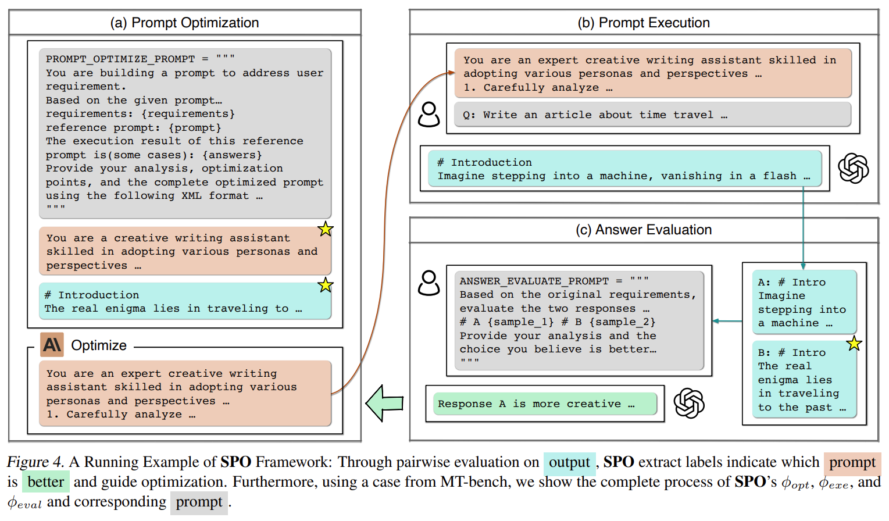
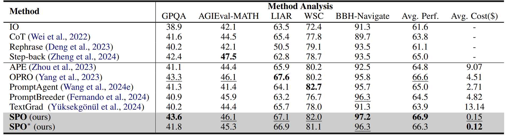
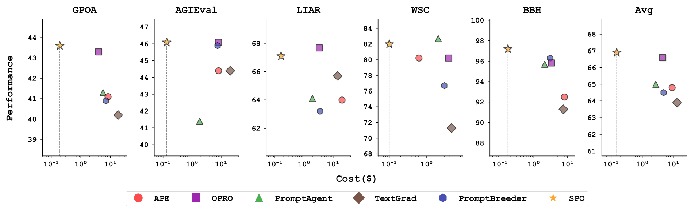
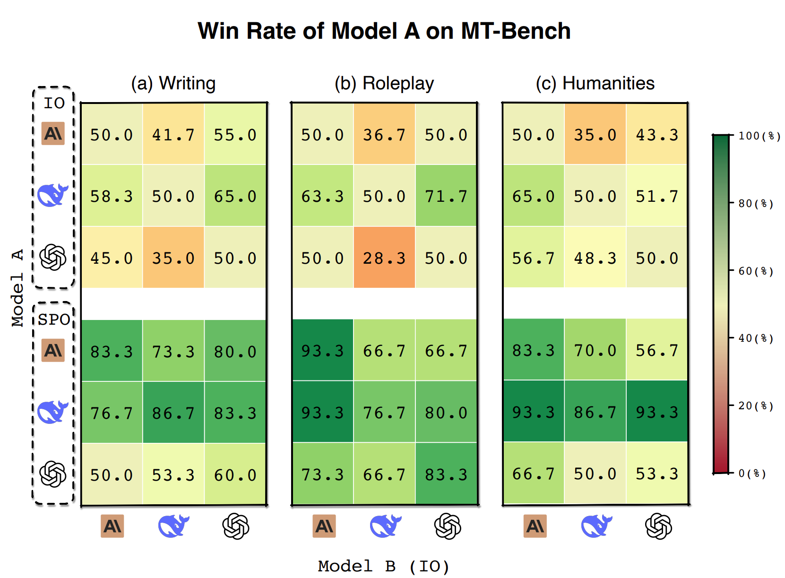

# SPO | Self-Supervised Prompt Optimization 

[](https://arxiv.org/pdf/2502.06855)
[](https://huggingface.co/spaces/XiangJinYu/SPO)
[](https://modelscope.cn/studios/AI-ModelScope/SPO)

An automated prompt engineering tool for Large Language Models (LLMs), designed for universal domain adaptation.

A next-generation prompt engineering system implementing **Self-Supervised Prompt Optimization (SPO)**. Achieves state-of-the-art performance with 17.8-90.9× higher cost efficiency than conventional methods. 🚀

<p align="center">
<a href="">1</sub>" width="80%"></a>
</p>

## ✨ Core Advantages

- 💸 **Ultra-Low Cost** - _$0.15 per task optimization_
- 🏷️ **Zero Supervision** - _No ground truth/human feedback required_
- ⚡ **Universal Adaptation** - _Closed & open-ended tasks supported_
- 🔄 **Self-Evolving** - _Auto-optimization via LLM-as-judge mechanism_

## 🔗 Quick Links

- [📝 Read our paper](https://arxiv.org/pdf/2502.06855)
- [🤗 Try our Hugging Face demo](https://huggingface.co/spaces/XiangJinYu/SPO)
- [🔮 Try our ModelScope demo](https://modelscope.cn/studios/AI-ModelScope/SPO)


## 📊 Experiment

###  Closed Tasks
<p align="center">
<a href="">1</sub>" width="80%"></a>
<a href="">1</sub>" width="80%"></a>
</p>

*SPO demonstrates superior cost efficiency, requiring only 1.1% to 5.6% of the cost of state-of-the-art methods while maintaining competitive performance.*

### Open-ended Tasks
<p align="center">
<a href="">1</sub>" width="80%"></a>
</p>

*SPO significantly improves model performance across all model configurations in open-ended tasks.*

## 🚀 Quick Start

### 1. Configure Your API Key ⚙️

Configure LLM parameters in `config/config2.yaml` (see `examples/spo/config2.example.yaml` for reference)
### 2. Define Your Iteration template 📝

Create a Iteration template file `metagpt/ext/spo/settings/task_name.yaml`:
```yaml
prompt: |
  Please solve the following problem.

requirements: |
  ...

count: None

qa:
  - question: |
      ...
    answer: |
      ...

  - question: |
      ...
    answer: |
      ...
```

Notes:
- `prompt`: Initial prompt for iteration
- `requirements`: Desired effects/outcomes (e.g., generate more thinking, use more humorous language)
- `count`: Target word count for the generated prompt (e.g., 50). Set to None for no limit
- `faq`: QA pairs used for iteration, can include appropriate number of pairs (typically 3)
  - `question`: Questions from the dataset used for iteration
  - `answer`: Corresponding answers. Can contain desired thinking patterns or responses instead of actual answers, or can be left empty. See `metagpt/ext/spo/settings/Navigate.yaml` for reference

### 3. Implement the PromptOptimizer 🔧

You have three ways to run the PromptOptimizer:

#### Option 1: Python Script

```python
from metagpt.ext.spo.components.optimizer import PromptOptimizer
from metagpt.ext.spo.utils.llm_client import SPO_LLM

if __name__ == "__main__":
  # Initialize LLM settings
  SPO_LLM.initialize(
    optimize_kwargs={"model": "claude-3-5-sonnet-20240620", "temperature": 0.7},
    evaluate_kwargs={"model": "gpt-4o-mini", "temperature": 0.3},
    execute_kwargs={"model": "gpt-4o-mini", "temperature": 0}
  )

  # Create and run optimizer
  optimizer = PromptOptimizer(
    optimized_path="workspace",  # Output directory
    initial_round=1,  # Starting round
    max_rounds=10,  # Maximum optimization rounds
    template="Poem.yaml",  # Template file
    name="Poem",  # Project name
  )

  optimizer.optimize()
```

#### Option 2: Command Line Interface

```bash
python -m examples.spo.optimize
```

Available command line options:
```
--opt-model            Model for optimization (default: claude-3-5-sonnet-20240620)
--opt-temp            Temperature for optimization (default: 0.7)
--eval-model          Model for evaluation (default: gpt-4o-mini)
--eval-temp          Temperature for evaluation (default: 0.3)
--exec-model          Model for execution (default: gpt-4o-mini)
--exec-temp          Temperature for execution (default: 0)
--workspace          Output directory path (default: workspace)
--initial-round      Initial round number (default: 1)
--max-rounds        Maximum number of rounds (default: 10)
--template          Template file name (default: Poem.yaml)
--name              Project name (default: Poem)
```

For help:
```bash
python -m examples.spo.optimize --help
```

#### Option 3: Streamlit Web Interface

For a more user-friendly experience, you can use the Streamlit web interface to configure and run the optimizer.

First, install Streamlit:
```bash
pip install "streamlit~=1.42.0"
```

Then run the web interface:
```bash 
python -m streamlit run metagpt/ext/spo/app.py
```

### 4. View Results
```
workspace
  └── Project_name
      └── prompts
          ├── results.json 
          ├── round_1
          │   ├── answers.txt
          │   └── prompt.txt
          ├── round_2
          │   ├── answers.txt
          │   └── prompt.txt
          ├── round_3
          │   ├── answers.txt
          │   └── prompt.txt
          ├── ...
          └── round_n
              ├── answers.txt
              └── prompt.txt
```

- `results.json`: Stores whether each iteration round was judged successful and other related information
- `prompt.txt`: The optimized prompt for the corresponding round
- `answers.txt`: The output results generated using the prompt for the corresponding round

## Citation

If you use SPO in your research, please cite our paper:

```
@misc{xiang2025spo,
      title={Self-Supervised Prompt Optimization}, 
      author={Jinyu Xiang and Jiayi Zhang and Zhaoyang Yu and Fengwei Teng and Jinhao Tu and Xinbing Liang and Sirui Hong and Chenglin Wu and Yuyu Luo},
      year={2025},
      eprint={2502.06855},
      archivePrefix={arXiv},
      primaryClass={cs.CL},
      url={https://arxiv.org/abs/2502.06855}, 
}
```