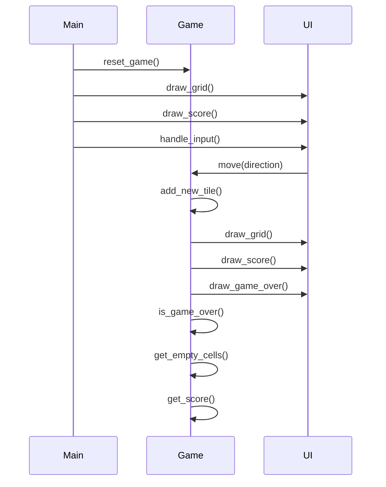

### Code Review All

#### game.py
- The `add_new_tile` function should handle the case when there are no empty cells left.
- The `move` function should update the score when tiles are merged.

#### main.py
- The game loop does not handle the game over condition properly. It should break the loop when the game is over.

### Call flow


### Summary
The code implements the 2048 game using Python classes and data structures. The Pygame library is used for the game interface and user input handling. The `game.py` file contains the `Game` class and related functions for game logic, while the `main.py` file initializes the game and UI.

### TODOs
```python
{
    "game.py": "Add handling for no empty cells in add_new_tile function, Update score in move function",
    "main.py": "Handle game over condition in the game loop"
}
```